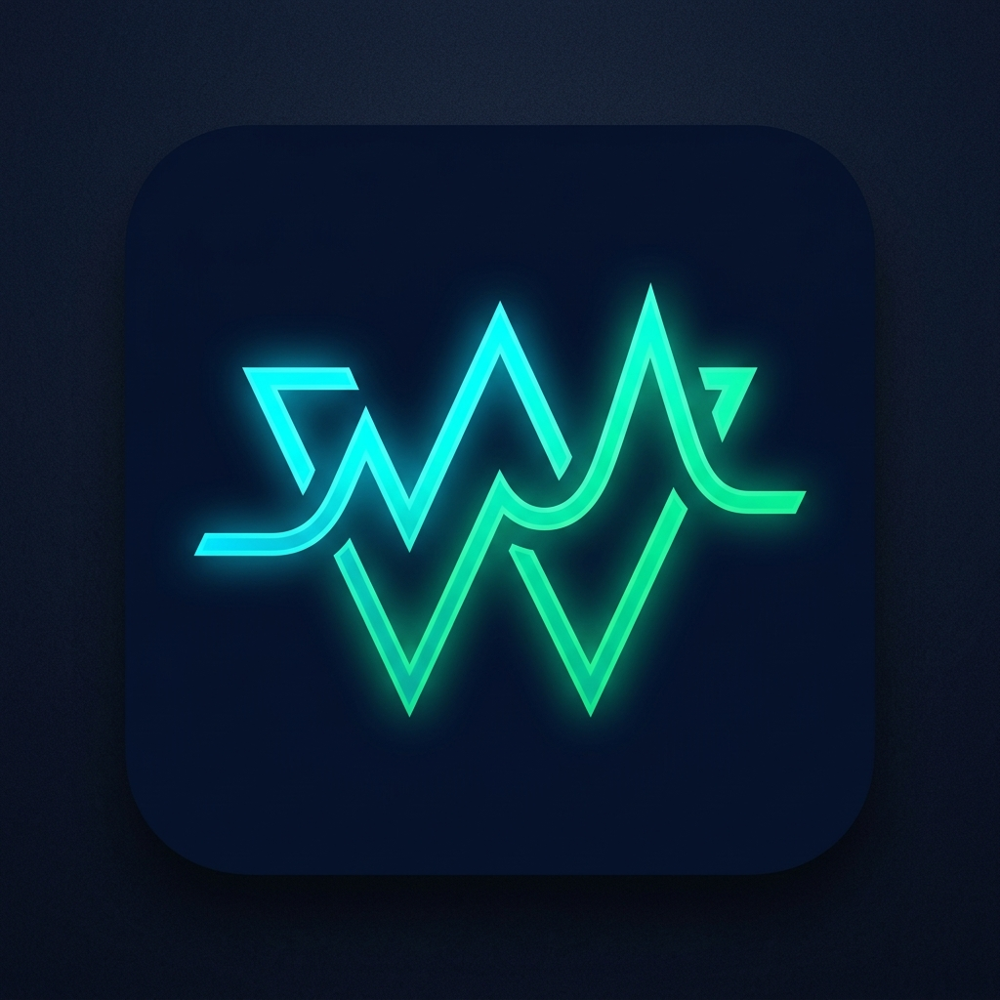

<p align="center">
  
</p>

<h1 align="center">Wateera (وتيرة)</h1>

<p align="center">
  <b>The Unified Personal Life Operating System & Offline Execution Engine</b>
</p>

<p align="center">
  <a href="https://expo.dev"></a>
  <a href="https://reactnative.dev"></a>
  <a href="https://www.typescriptlang.org"></a>
  <a href="https://www.android.com"></a>
  <a href="LICENSE"></a>
</p>

---

## 🌟 Overview

**Wateera** orchestrates productivity, physical fitness, academic progress, career goals, medication routines, and private financial ledgers into one cohesive, beautifully designed mobile experience.

Engineered with dark-mode glassmorphic aesthetics, fluid 60fps micro-animations, and complete privacy: your data remains on your device, with zero external trackers, no mandatory cloud accounts, and no third-party data collection.

---

## ⚡ Key Modules & Features

### 1. 📋 Global Tasks & Cross-Module Execution
- **Centralized Action Hub:** Aggregates and tracks tasks from Study, Work, Gym, and Focus into a unified filterable matrix.
- **Instant Task Start:** One-tap `▶ Start` button triggers immediate offline notifications and active execution status.
- **Dynamic Task Scheduling:** Schedule tasks to start immediately or after customizable intervals (5 min, 15 min, etc.).
- **Progress Tracking:** High-contrast visual indicators (`⚡ IN PROGRESS`) and interactive completion toggles.

### 2. 🔔 100% Offline Android Pop Notifications
- **Zero Internet Required:** Completely free from push server dependencies, Firebase credentials, or network connectivity.
- **Heads-Up Banner System:** Native spring physics and haptic feedback slide down high-visibility alert cards for started and scheduled tasks.
- **Dynamic Content Wrapping:** Text containers automatically scale to fit lengthy titles and instructions without clipping.
- **Strictly Android Guarded:** Targeted specifically for Android notification handling and foreground rendering.

### 3. 🏋️ Gym & Fitness Architecture
- **7-Day Split Builder:** Tailored routines covering Push, Pull, Legs, Shoulders, Core, and Conditioning.
- **3-Set Logging Table:** Record weights (kg), reps, and completion states set-by-set with quick incremental steppers.
- **Interactive Anatomy Viewer:** Visual muscular mapping highlighting target muscle groups (Chest, Back, Legs, Calves, Shoulders, Arms, Abs).
- **Progress & Volume Analytics:** Dynamic progression tracking comparing top exercise volume and maximum lift weights across sessions.

### 4. 📚 Academic Study Planner
- **Time-Block Schedule:** Organize study sessions with dedicated category tagging, notes, and duration tracking.
- **Bi-Directional Checklist Sync:** Sub-tasks generated within a study block automatically sync status with the Global Tasks engine.
- **Session Quick-Start:** Launch targeted study blocks with real-time progress visualization.

### 5. 💼 Executive Work Engine
- **Professional Project Blocks:** Structure operational sprints, client deliverables, and milestones.
- **Nested Deliverables:** Hierarchical checklist matrix ensuring deep focus on primary deliverables.
- **Dual Status Sync:** Mark deliverables complete from either the Work engine or the centralized Task list.

### 6. ⏱️ Focus Sprint Engine
- **Configurable Pomodoro Timers:** Quick presets for 5-minute clarity sprints, 15-minute intervals, or 25-minute deep work blocks.
- **Animated Focus Ring:** Real-time visual progress ring with smooth second-by-second countdown.
- **Completion Alerts:** Offline notification alerts upon completing focus blocks with automated task history logging.

### 7. 🛡️ Air-Gapped Finances & Receivables
- **Strict Cryptographic Isolation:** Financial transactions and debt ledgers are completely decoupled from external modules.
- **Income & Expense Ledger:** Categorized tracking with dynamic breakdown charts.
- **Money Owed Tracker (Receivables):** Track funds lent to others, partial repayments, remaining balances, and full settlements.
- **Visual Balance Analytics:** Interactive donut charts and trend lines reflecting real financial health.

### 8. 💊 Supplements & Medications Matrix
- **Daily Adherence Tracking:** Track supplements (Creatine, Whey, Vitamins) and prescription medications.
- **Schedule Management:** Day-of-week routines with intelligent morning/post-workout timing tags.
- **Intake History:** Toggle daily completion with persistent date-stamped adherence logs.

---

## 🛠️ Technology Stack

| Technology | Purpose |
| :--- | :--- |
| **React Native** (0.76) | Cross-platform core framework |
| **Expo** (SDK 53) | Development platform & runtime toolchain |
| **Expo Router** (v4) | File-based typed routing architecture |
| **TypeScript** | Strict type safety and maintainable contracts |
| **React Native Reanimated** (v3) | High-performance 60fps UI animations |
| **Expo Haptics** | Tactile vibration and sensory feedback |
| **Vanilla Design System** | Curated palette, dark-mode glassmorphism, and responsive layouts |

---

## 📁 Project Structure

```text
Wateera/
├── assets/                  # Application logos, branding, and imagery
├── src/
│   ├── app/                 # Expo Router file-based pages
│   │   ├── _layout.tsx      # Root layout, theme provider, and drawer
│   │   ├── index.tsx        # Central Command dashboard
│   │   ├── tasks.tsx        # Global tasks and productivity matrix
│   │   ├── gym.tsx          # Workout logger & routine builder
│   │   ├── study.tsx        # Study sessions & nested sub-tasks
│   │   ├── work.tsx         # Work projects & deliverables
│   │   ├── focus.tsx        # Deep focus timer & countdown ring
│   │   ├── finances.tsx     # Air-gapped private ledger & debts
│   │   └── supplements.tsx  # Daily supplements & medication schedule
│   ├── components/
│   │   ├── charts/          # Interactive progress charts (Pie, Line, Bars)
│   │   ├── common/          # GlassCard, InAppNotificationBanner, etc.
│   │   ├── focus/           # Circular FocusRing timer component
│   │   ├── gym/             # AnatomyViewer muscular system
│   │   └── navigation/      # AnimatedDrawer & BottomNavBar
│   ├── constants/           # Design system tokens, colors, and shadows
│   ├── services/            # Offline notifications and storage engines
│   ├── store/               # Centralized reactive store (clean, zero mock data)
│   └── types/               # Domain data contracts & interfaces
├── app.json                 # Expo project configuration
├── package.json             # Dependencies and build scripts
└── tsconfig.json            # TypeScript configuration
```

---

## 🚀 Getting Started

### Prerequisites
- [Node.js](https://nodejs.org/) (v18 or higher recommended)
- [npm](https://www.npmjs.com/) or [yarn](https://yarnpkg.com/)
- [Expo Go](https://expo.dev/go) app on Android (or an Android Emulator / physical device)

### Installation

1. **Clone the Repository:**
   ```bash
   git clone https://github.com/SaadRimeh/Wateera.git
   cd Wateera
   ```

2. **Install Dependencies:**
   ```bash
   npm install
   ```

3. **Start the Development Server:**
   ```bash
   npx expo start -c
   ```

4. **Launch on Android:**
   - Press `a` in the terminal to open on a connected Android device or emulator.
   - Scan the terminal QR code using the **Expo Go** app on your physical Android device.

---

## 🔒 Privacy & Air-Gap Architecture

Wateera is built around a strict user-first privacy philosophy:
- **No Remote Tracking:** Zero analytics tracking, telemetry, or behavioral tracking SDKs.
- **Local Persistence:** All tasks, workouts, study sessions, and financial transactions are stored strictly in local on-device persistent storage.
- **Air-Gapped Finances:** The finance engine runs in complete isolation with zero network requirements.

---

## 📬 Contact & Support

If you have questions, feedback, feature requests, or collaboration opportunities, feel free to get in touch:

- **Lead Developer & Creator:** Saad Rimeh
- **Email:** [Saad.rimeh.01@gmail.com](mailto:Saad.rimeh.01@gmail.com)
- **GitHub:** [@SaadRimeh](https://github.com/SaadRimeh)
- **Repository:** [https://github.com/SaadRimeh/Wateera](https://github.com/SaadRimeh/Wateera)

---

## 📄 License

This project is licensed under the MIT License — see the [LICENSE](LICENSE) file for details.

Developed with ❤️ by **Saad Rimeh**.
